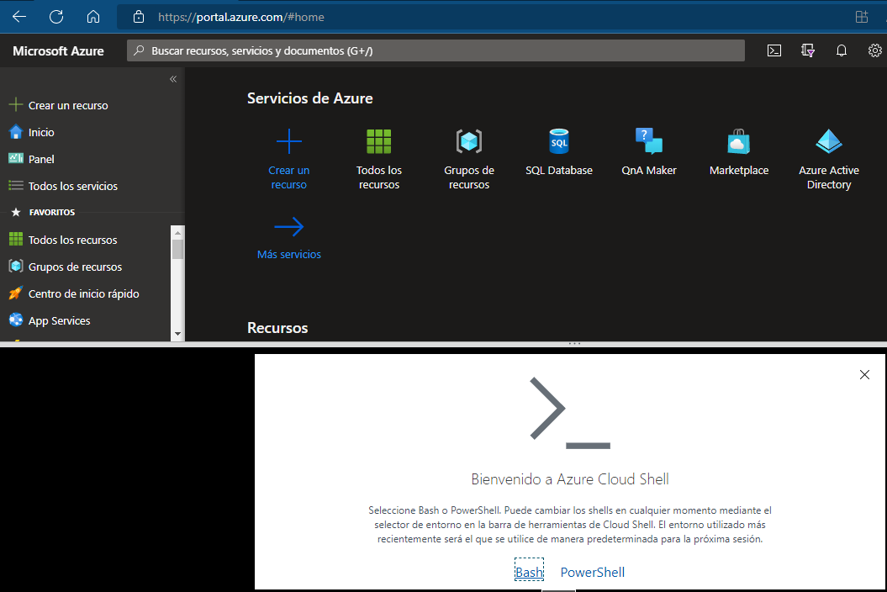
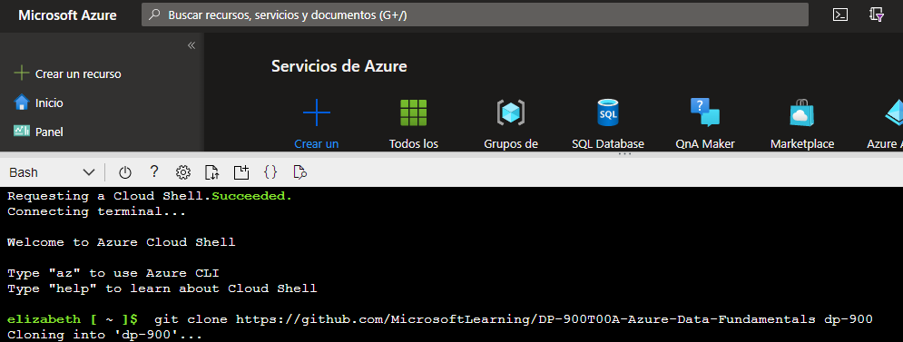
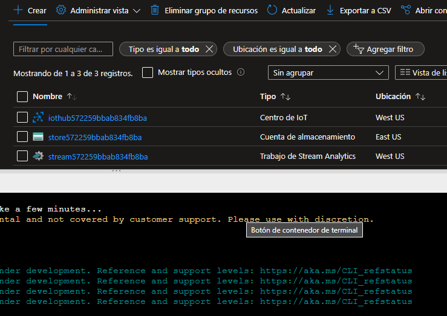

# Datos en tiempo real con _Azure Stream Analytics_ 💥
⭐⭐⭐⭐⭐

**¡Hola a todxs!**

En este repo encontrarán:

* Pasos a seguir para realizar la simulación dentro del Portal de Azure.
* La [presentación del taller](https://www.canva.com/design/DAFTrdkz0h4/Unkoezl0YRJZIW9G8ZCP_A/view?utm_content=DAFTrdkz0h4&utm_campaign=designshare&utm_medium=link&utm_source=publishsharelink
).

## Creación de recursos a utilizar

Nos dirigimos al portal de Azure e iniciamos el cloud Shell donde crearemos los  recursos.

1. Descargar los archivos.

          git clone https://github.com/MicrosoftLearning/DP-900T00A-Azure-Data-Fundamentals dp-900

2. Cambiar el directorio.

          cd dp-900/streaming

3. Ejecutar un script para crear los recursos de Azure necesarios.

          bash setup.sh

## Uso de los recursos creados

Una vez que los recursos se han creado, iniciamos la simulación con:

           bash iotdevice.sh 

Y ahora si tenemos todo listo para comenzar a analizar los datos.

¡Bievenidas contribuciones! :octocat:

🛠️  _Built by **Lizzie Lucas**_
